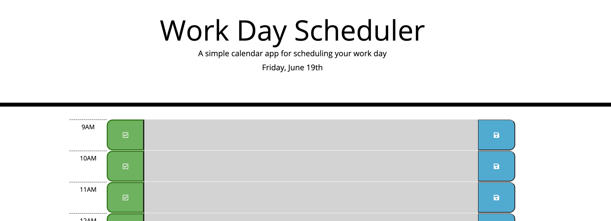

# Work-Day-Scheduler

This Work Day Scheduler is a light app that allows you to add and save text to the hours of your work day. 

This not only helps you save important meetings and to-dos, but also shows you where you are in your day for quick reference; highlighting the current hour in red, past hours in grey, and future hours in green.

The app also has an additional feature of a check button that marrys the idea of a to-do list to your planner, giving you the satisfaction of checking things off your list, like the do-er you are! 

Let's get it done! 

